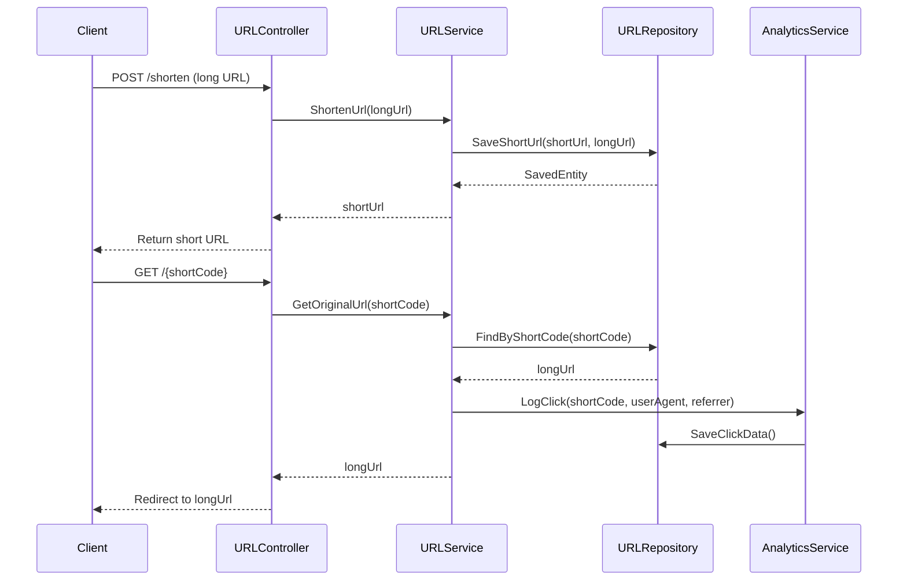

```mermaid
sequenceDiagram
    participant Client
    participant URLController
    participant URLService
    participant URLRepository
    participant AnalyticsService

    Client->>URLController: POST /shorten (long URL)
    URLController->>URLService: ShortenUrl(longUrl)
    URLService->>URLRepository: SaveShortUrl(shortUrl, longUrl)
    URLRepository-->>URLService: SavedEntity
    URLService-->>URLController: shortUrl
    URLController-->>Client: Return short URL

    Client->>URLController: GET /{shortCode}
    URLController->>URLService: GetOriginalUrl(shortCode)
    URLService->>URLRepository: FindByShortCode(shortCode)
    URLRepository-->>URLService: longUrl
    URLService->>AnalyticsService: LogClick(shortCode, userAgent, referrer)
    AnalyticsService->>URLRepository: SaveClickData()
    URLService-->>URLController: longUrl
    URLController-->>Client: Redirect to longUrl
```
